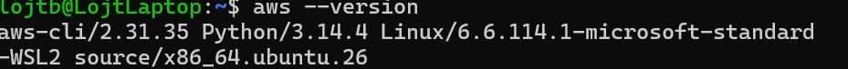
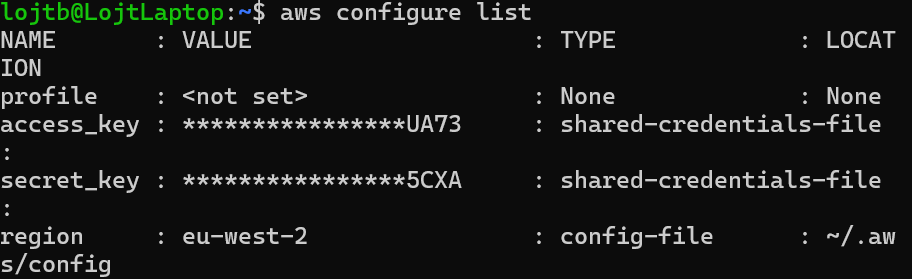

# AWS CLI Basics - Solution

Name:

GitHub Username:

---

# Task 1 - Verify AWS CLI

## aws --version

```text

```

### Screenshot



---

# Task 2 - AWS Configuration

## aws configure list

```text

```

### Screenshot



---

# Task 3 - Caller Identity

## aws sts get-caller-identity

```text

```

### Screenshot


---

# Task 4 - AWS Regions

Number of Regions:

Default Region:

Closest Region:

### Screenshot


---

# Task 5 - Availability Zones

Number of AZs:

Why are multiple AZs important?

### Screenshot


---

# Task 6 - S3 Investigation

Buckets:

Reason if none exist:

### Screenshot


---

# Task 7 - IAM Investigation

IAM Users:

Why avoid using the root account?

### Screenshot


---

# Task 8 - EC2 Investigation

Running Instances:

Key Pairs:

Instance Types:

### Screenshot


---

# Task 9 - Output Formats

Preferred format:

Reason:

### Screenshot


---

# Reflection

...

---

# Bonus

### Screenshot


