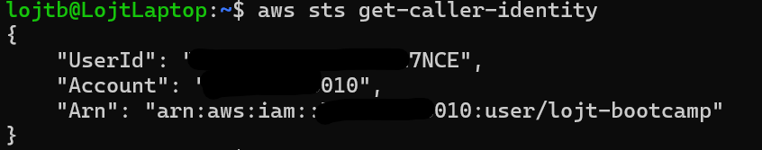

# AWS CLI Basics - Solution

Name: Balint Lojt

GitHub Username: lojt-cloud

---

# Task 1 - Verify AWS CLI

## aws --version
aws-cli/2.31.35 Python/3.14.4 Linux/6.6.114.1-microsoft-standard-WSL2 source/x86_64.ubuntu.26

```

### Screenshot


---

# Task 2 - AWS Configuration

## aws configure list

NAME       : VALUE                    : TYPE             : LOCATION
profile    : <not set>                : None             : None
access_key : ****************UA73     : shared-credentials-file :
secret_key : ****************5CXA     : shared-credentials-file :
region     : eu-west-2                : config-file      : ~/.aws/config

```

### Screenshot


---

# Task 3 - Caller Identity

## aws sts get-caller-identity

 aws sts get-caller-identity
{
    "UserId": "*************27NCE",
    "Account": "*************010",
    "Arn": "arn:aws:iam::*************010:user/lojt-bootcamp"
}

```

### Screenshot



---

# Task 4 - AWS Regions

Number of Regions:

Default Region:

Closest Region:

### Screenshot


---

# Task 5 - Availability Zones

Number of AZs:

Why are multiple AZs important?

### Screenshot


---

# Task 6 - S3 Investigation

Buckets:

Reason if none exist:

### Screenshot


---

# Task 7 - IAM Investigation

IAM Users:

Why avoid using the root account?

### Screenshot


---

# Task 8 - EC2 Investigation

Running Instances:

Key Pairs:

Instance Types:

### Screenshot


---

# Task 9 - Output Formats

Preferred format:

Reason:

### Screenshot


---

# Reflection

...

---

# Bonus

### Screenshot


